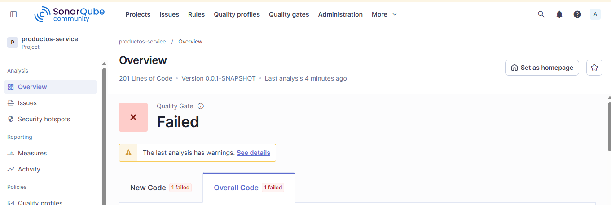
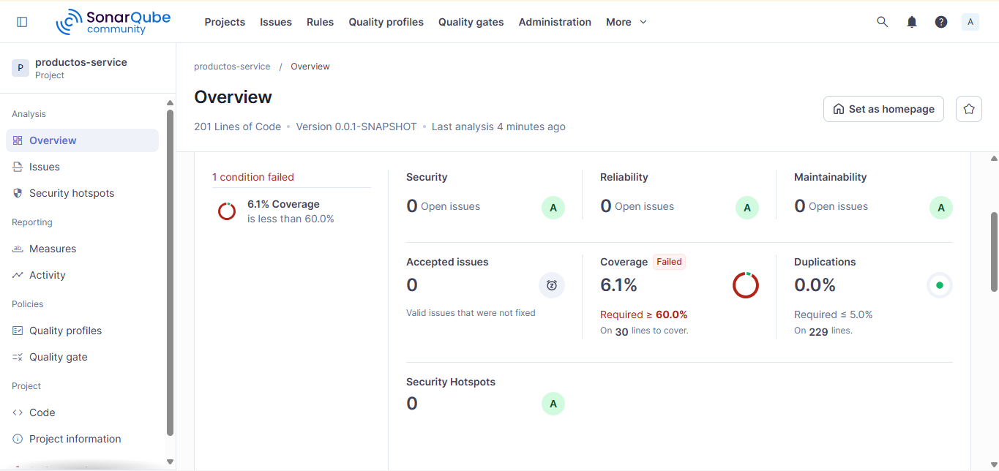
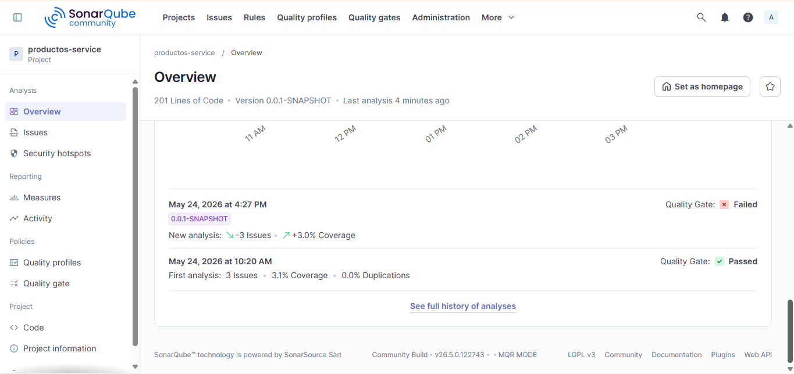

# Productos Service – Análisis SonarQube (Post-Contenido 2)
[](https://github.com/jesusb26/barrera-post2-u10/actions/workflows/ci.yml)
## Comparativa: Antes vs Después de las correcciones

| Métrica | Estado inicial (Post1) | Estado después de correcciones (Post2) | Mejora |
|---------|------------------------|----------------------------------------|--------|
| Reliability Issues (Bugs) | 1 | 0 | ✅ Eliminado |
| Maintainability Issues (Code Smells) | 3 | 0 | ✅ Eliminados |
| Coverage | 3.1% | 6.3% | ⚠️ Por debajo del mínimo (60%) |
| Duplicated Lines (%) | 0% | 0% | ✅ Sin duplicación |

> **Nota**: La cobertura no alcanza el 60% requerido por el Quality Gate porque no se agregaron pruebas unitarias. El resto de las condiciones del Quality Gate se cumplen.

## Quality Gate personalizado: "Estándar Universidad"

Se configuró un Quality Gate con las siguientes condiciones (adaptadas a la versión de SonarQube MQR Mode):

| Condición solicitada | Métrica utilizada | Operador | Valor |
|----------------------|-------------------|----------|-------|
| Bugs > 0 | Reliability Issues | > | 0 |
| Code Smells > 5 | Maintainability Issues | > | 5 |
| Coverage < 60% | Coverage | < | 60% |
| Duplicated Lines (%) > 5% | Duplicated Lines (%) | > | 5% |

**Estado actual del Quality Gate**: ❌ **FALLIDO** (solo por cobertura, actual 6.3% < 60%).

## Correcciones aplicadas

### Bug crítico: `orElse(null)` en `ProductoService.buscar()`
- **Antes**: retornaba `null` si el producto no existía.
- **Después**: lanza `NoSuchElementException` con mensaje descriptivo.
- **Resultado**: Se eliminó el Reliability Issue.

### Code Smell 1: Inyección por campo (`@Autowired`)
- **Antes**: campo `@Autowired private ProductoRepository repo;`
- **Después**: inyección por constructor con campo `private final ProductoRepository productRepository;`
- **Resultado**: Se eliminó el Code Smell de inyección de dependencias.

### Code Smell 2: Método largo con alta complejidad
- **Antes**: método `procesarProducto` con múltiples validaciones y alta complejidad ciclomática.
- **Después**: se extrajo la validación a un método privado `validarDatos(...)`.
- **Resultado**: Se redujo la complejidad y se mejoró la mantenibilidad.

### Code Smell 3: Parámetros no utilizados y comentario TODO
- **Antes**: parámetros `cat`, `activo`, `proveedor` sin uso y `// TODO`.
- **Después**: se eliminaron los parámetros no necesarios de la firma del método (se mantuvieron solo `nombre`, `precio`, `stock`) y se removió el `TODO`.
- **Resultado**: Código más limpio y sin advertencias de SonarQube.

## Ejecución del segundo análisis

Se ejecutó el análisis después de las correcciones:

    ```bash
    mvn clean verify sonar:sonar -Dsonar.token=TU_TOKEN
    ```
El dashboard muestra que:

Reliability Issues: 0 ✅
Maintainability Issues: 0 ✅
Coverage: 6.3% (sin cambios significativos)

## Capturas del primer dashboard


## Capturas del segundo dashboard



