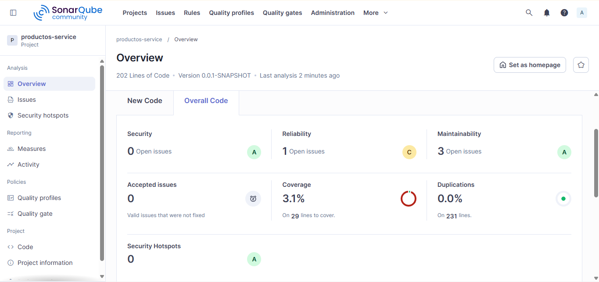
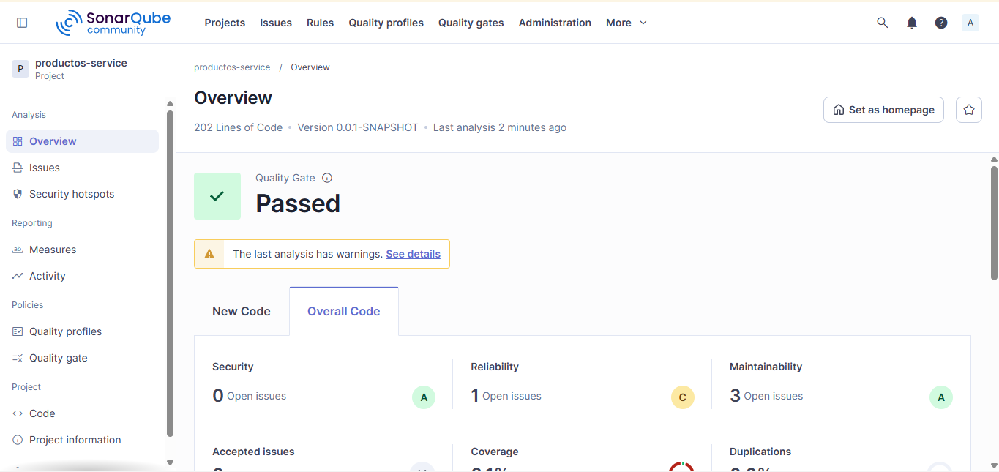
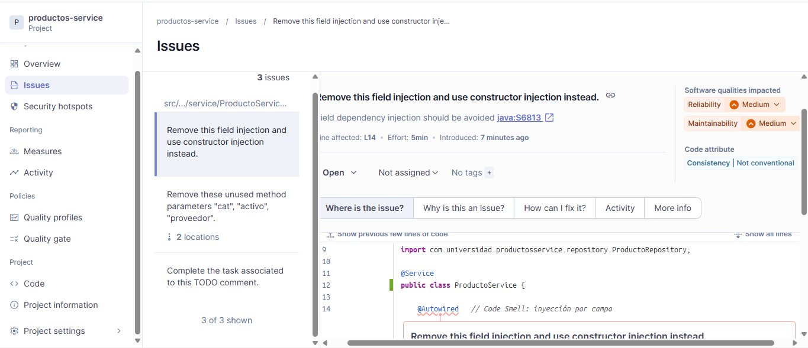
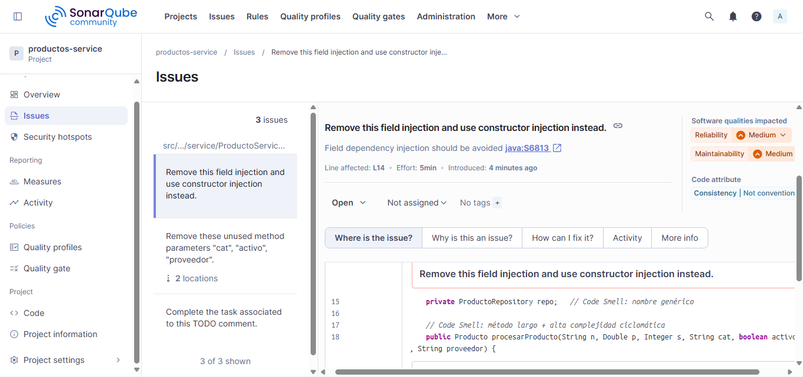
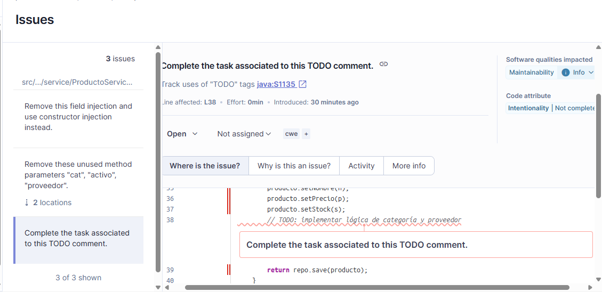

# Productos Service – Análisis SonarQube

## Estado inicial del análisis

| Categoría | Cantidad | Rating |
|-----------|----------|--------|
| Bugs | 1 | C |
| Vulnerabilidades | 0 | A |
| Code Smells | 3 | D |
| Cobertura | 3.1% | — |

## Hallazgos principales identificados

### Bug 1: Posible NullPointerException en `getEstado()` de la entidad Producto
- **Archivo**: `Producto.java`, línea 17 (método `getEstado()`)
- **Descripción**: El método maneja `stock == null` como "DESCONOCIDO", pero luego hay una rama `return "DESCONOCIDO"` al final que nunca se ejecuta (inalcanzable). Además, la lógica de negocio dentro de una entidad JPA es un code smell en sí mismo.
- **Severidad**: Major (según lo muestra SonarQube en Reliability issues)

### Code Smell 1: Inyección de dependencias por campo (Field injection)
- **Archivo**: `ProductoService.java`, línea 14
- **Descripción**: Se usa `@Autowired` directamente sobre un campo. Esto dificulta las pruebas unitarias y viola el principio de inmutabilidad. SonarQube recomienda usar inyección por constructor.
- **Severidad**: Medium (Maintainability)

### Code Smell 2: Parámetros de método no utilizados
- **Archivo**: `ProductoService.java`, línea 18 (método `procesarProducto`)
- **Descripción**: Los parámetros `cat`, `activo` y `proveedor` se declaran pero nunca se usan dentro del método. Esto aumenta la complejidad sin necesidad y puede llevar a confusión.
- **Severidad**: Medium (Maintainability)

### Code Smell 3: Comentario TODO pendiente
- **Archivo**: `ProductoService.java`, línea 40 (aproximadamente)
- **Descripción**: Existe un comentario `// TODO: implementar lógica de categoría y proveedor` que indica trabajo incompleto. SonarQube marca los TODOs como code smells porque representan tareas pendientes que pueden afectar la calidad si se olvidan.
- **Severidad**: Minor

## Capturas del dashboard







## Instrucciones para ejecutar el análisis localmente

1. Asegúrate de tener Docker Desktop ejecutándose y SonarQube corriendo:
   ```bash
   docker start sonarqube
   ```
2. En la raíz del proyecto, ejecuta:
   ```bash
   mvn clean verify sonar:sonar -Dsonar.token=TU_TOKEN
   ```
3. Abre http://localhost:9000 y ve al proyecto productos-service para ver los resultados.